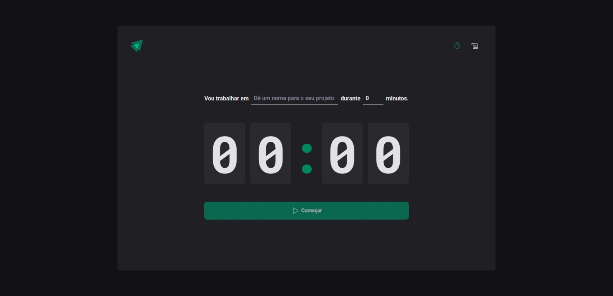
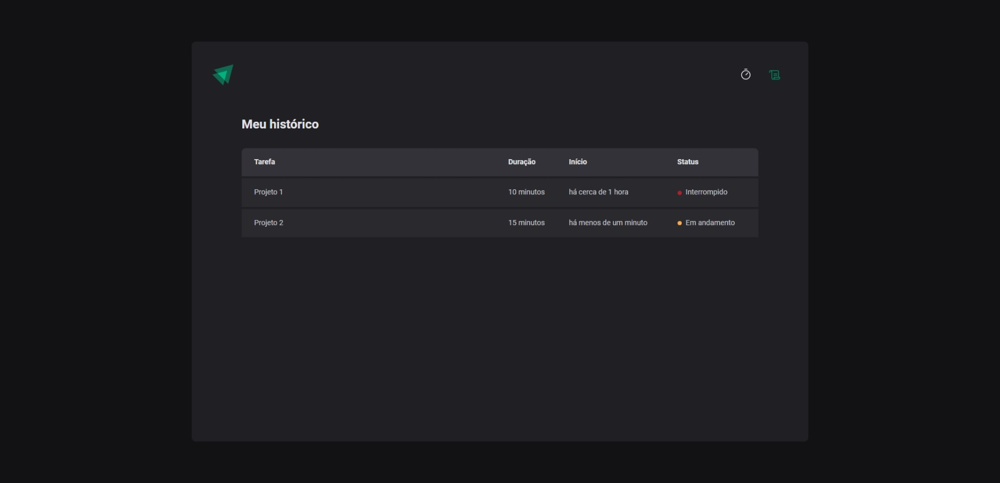

<h1 align="center">
  Ignite Timer
</h1>


## 💻 Sobre o projeto

Projeto de um timer para controle de atividades, desenvolvido durante o **Ignite de ReactJS** oferecida pela [Rocketseat](https://www.rocketseat.com.br/ignite/).

---

## ⚙️ Funcionalidades

- [x] Início de uma atividade;
- [x] Interromper uma atividade;
- [x] Listagem do histórico de atividades.

---

## 🎨 Layout

<p align="center" style="display: flex; align-items: flex-start; justify-content: center;">
  
  
</p>

---

## 🚀 Como executar o projeto

### Pré-requisitos

Antes de começar, você vai precisar ter instalado em sua máquina as seguintes ferramentas:
[Git](https://git-scm.com), [Node.js](https://nodejs.org/en/).
Além disto é bom ter um editor para trabalhar com o código como [VSCode](https://code.visualstudio.com/)

#### 🧭 Rodando a aplicação web (Frontend)

```bash
# Clone este repositório
$ git clone git@github.com:PedroZago/02-ignite-reactjs-timer.git
# Acesse a pasta do projeto no seu terminal/cmd
$ cd 02-ignite-reactjs-timer
# Instale as dependências
$ yarn add
# Execute a aplicação em modo de desenvolvimento
$ yarn dev
# A aplicação será aberta na porta:5173 - acesse http://localhost:5173
```

---

## 🛠 Tecnologias

As seguintes ferramentas foram usadas na construção do projeto:

#### **Website** ([React](https://reactjs.org/) + [TypeScript](https://www.typescriptlang.org/))

- **[Vite](https://vitejs.dev/)**

---

## 📝 Licença

Este projeto esta sobe a licença [MIT](./LICENSE).
